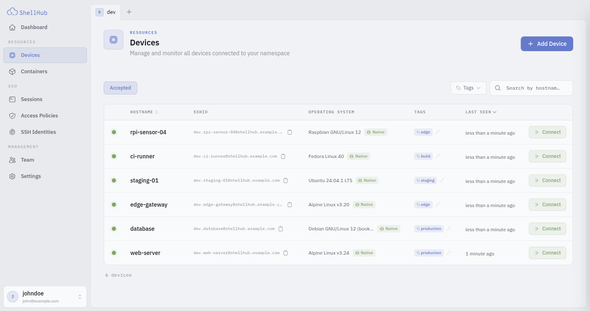

<p align="center">
  <a href="https://shellhub.io">
    <picture>
      <source media="(prefers-color-scheme: dark)" srcset=".github/assets/logo-dark.svg">
      
    </picture>
  </a>
</p>

<p align="center">
  <strong>Centralized SSH for Linux devices and servers behind NAT and firewalls.</strong>
</p>

<p align="center">
  <a href="https://github.com/shellhub-io/shellhub/releases/latest"></a>
  <a href="LICENSE.md"></a>
  <a href="https://hub.docker.com/r/shellhubio/agent"></a>
  <a href="https://github.com/shellhub-io/shellhub/actions/workflows/qa.yml"></a>
</p>

<p align="center">
  <a href="https://shellhub.io">Website</a> ·
  <a href="https://docs.shellhub.io">Documentation</a> ·
  <a href="https://cloud.shellhub.io">ShellHub Cloud</a> ·
  <a href="https://github.com/shellhub-io/shellhub/discussions">Discussions</a>
</p>

ShellHub is an SSH gateway that ties every login to a person on your team. A small agent on each
device dials out to the ShellHub server, and you reach the device through the server with `ssh`,
`scp`, `sftp` or the browser. The device needs no public IP or inbound port, whether it is a
server, a cloud instance or an embedded Linux device in the field.

<picture>
  <source media="(prefers-color-scheme: dark)" srcset=".github/assets/screenshot-dark.png">
  
</picture>

## Quickstart

**ShellHub Cloud.** Create a free account at [cloud.shellhub.io](https://cloud.shellhub.io). The
console walks you through your first device.

**Self-hosted.** You need Docker with Compose, and ports 80 and 22 free on the host:

```sh
git clone -b v0.27.0 https://github.com/shellhub-io/shellhub.git
cd shellhub
make start
```

Open `http://<your-server>/setup` to create the admin account and its namespace. The
[deployment guide](https://docs.shellhub.io/self-hosted/deploying) covers HTTPS and production
settings.

**Add a device.** Run the installer on the device:

```sh
curl -sSf http://<your-server>/install.sh | sh
```

The agent prints a pairing code. Enter it in the console to pair the device, then open a shell
from the console or from any SSH client:

```sh
ssh <user>@<namespace>.<device>@<your-server>
```

To enroll many devices without pairing each one, create a provisioning key under **Add Device**
and pass it to the installer.

## Features

- **Standard SSH.** OpenSSH, PuTTY, `scp`, `sftp` and port forwarding work unchanged.
- **Web terminal.** Open a shell on any device from the console.
- **SSH Identities.** Every SSH login belongs to a person on your team, not to a key copied into
  `authorized_keys`, and it works with the plain `ssh` client, with no wrapper to install. Remove
  someone from the team and their access ends on every device at once.
- **Access Policies.** Default-deny rules for who reaches which devices and as which Linux user,
  managed in one place. A policy can also require a fresh sign-in before each session.
- **Sessions.** ShellHub logs every connection with the user, the source IP and the device.
- **Tags.** [Group devices](https://docs.shellhub.io/user-guides/devices/tagging%20devices) and
  filter by tag.
- **Platforms.** Packages for [Yocto](https://docs.shellhub.io/overview/supported-platforms/yocto),
  [Buildroot](https://docs.shellhub.io/overview/supported-platforms/buildroot),
  [FreeBSD](https://docs.shellhub.io/overview/supported-platforms/freebsd) and
  [Snap](https://docs.shellhub.io/overview/supported-platforms/snap).

## Editions

| Edition | Runs on | Adds |
|---------|---------|------|
| Community | Your servers | This repository, Apache 2.0 |
| Enterprise | Your servers | Session recording, MFA, SAML SSO, web endpoints |
| Cloud | Hosted by us | The Enterprise features, free to start |

See [editions](https://docs.shellhub.io/overview/editions) for the full comparison.

## Contributing

Read [CONTRIBUTING.md](CONTRIBUTING.md) for the development setup and how to send a change. Ask
questions and share ideas in [Discussions](https://github.com/shellhub-io/shellhub/discussions);
report bugs in [Issues](https://github.com/shellhub-io/shellhub/issues). Security reports go
through [SECURITY.md](SECURITY.md).

## License

[O.S. Systems](https://www.ossystems.com.br) develops ShellHub and releases it under the
[Apache License 2.0](LICENSE.md).
